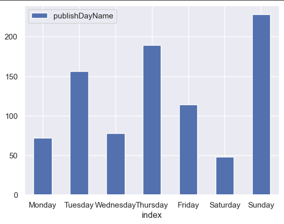
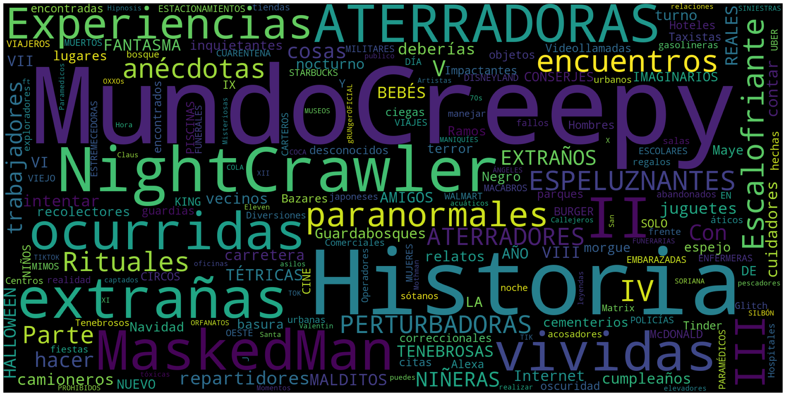

## Youtube Dataset

### using youtube API

Here i'm using the youtube API to retreive information from an especific youtube channel and the I analyze the dataset.

Here are some examples of the graphics generated using the dataset from "Mundo Creepy"

### Example of when the most videos are uploaded

### Example of common used words on the title

